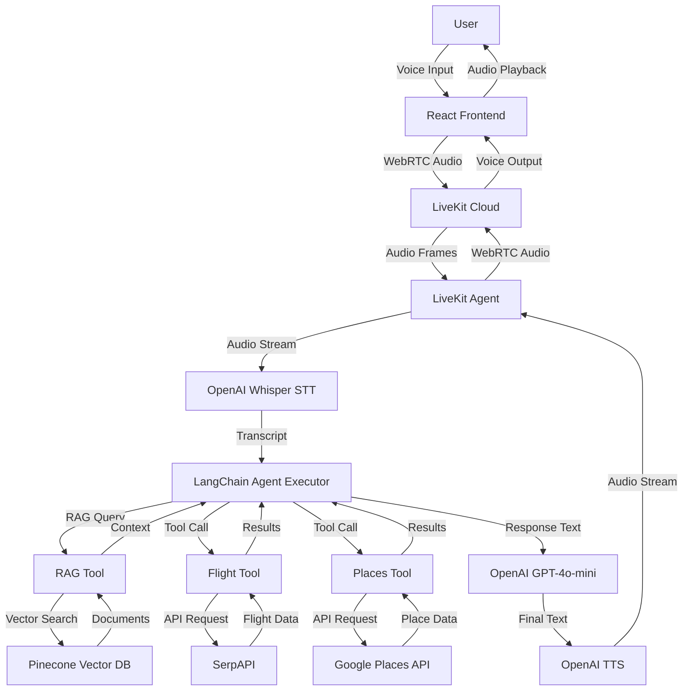

# Design Document

## System Overview

Paradise is a voice-enabled travel planning assistant that combines real-time voice communication with RAG-powered knowledge retrieval and external API tools. The system helps users plan complete trips through natural conversation, accessing travel guides, flight prices, and local recommendations.

## End-to-End Architecture

## RAG Integration

### PDF Processing Pipeline

1. **PDF Upload**: Users upload travel guide PDFs via the frontend
2. **Text Extraction**: PDFs are processed using `pypdf` to extract text content
3. **Document Classification**: Documents are classified by type (travel_guide, restaurant_guide, hotel_guide, etc.) and destination is extracted from filename or content
4. **Chunking**: Text is split into chunks using `RecursiveCharacterTextSplitter`:
   - Default chunk size: 1500 characters for travel guides
   - Chunk overlap: 300 characters
   - Section-aware chunking preserves context around headings
5. **Embedding**: Chunks are embedded using OpenAI's `text-embedding-3-small` model (1536 dimensions)
6. **Storage**: Embedded chunks are stored in Pinecone with metadata:
   - `destination`: Primary destination (city or country)
   - `section`: Content type (attractions, restaurants, hotels, transport, culture, tips)
   - `document_title`: Source document name
   - `source_file`: Original filename
   - `chunk_number`: Chunk index

### Vector Storage Strategy

**Pinecone Configuration**:

- Index type: Serverless (AWS us-east-1)
- Dimension: 1536 (OpenAI embedding dimension)
- Metric: Cosine similarity
- Namespace organization: Hierarchical (city → country → general)

**Namespace Hierarchy**:

- Documents are organized by destination into namespaces
- City-level documents stored in city namespace (e.g., "zurich")
- Country-level documents stored in country namespace (e.g., "switzerland")
- General documents stored in "general" namespace
- Retrieval searches hierarchically: city → country → general

### Retrieval Strategy

**Hierarchical Namespace Search**:

1. Extract destination from user query (e.g., "Zurich" or "Switzerland")
2. Map city to country if applicable (Zurich → Switzerland)
3. Search namespaces in order: city → country → general
4. Apply metadata filters for section type (attractions, restaurants, etc.)
5. Return top-k results (default: 5) with deduplication across namespaces

**Metadata Filtering**:

- Filter by destination for location-specific queries
- Filter by section type for content-specific queries (e.g., "restaurants in Zurich")
- Fallback to unfiltered search if no results found

## LiveKit Agent Design

### Voice Communication Flow

1. **Connection**: Agent joins LiveKit room when user connects
2. **Audio Setup**:
   - User audio track captured from room
   - Agent audio track published to room
3. **Speech-to-Text**: User audio streamed to OpenAI Whisper for real-time transcription
4. **Processing**: Transcripts sent to LangChain agent for processing
5. **Text-to-Speech**: Agent responses synthesized using OpenAI TTS
6. **Audio Streaming**: TTS audio streamed back to user via LiveKit

### Agent Orchestration

**Basic Agent** (`basic_agent.py`):

- Manages LiveKit room connection and lifecycle
- Handles audio track setup and streaming
- Coordinates STT and TTS engines
- Manages transcript display via data channels
- Handles graceful shutdown and cleanup

**LangChain Agent** (`langchain_agent.py`):

- Creates agent executor with tools and RAG
- Manages conversation history
- Routes queries to appropriate tools
- Handles tool selection and execution
- Formats responses for voice output

### Real-time Transcription

- User transcripts sent via LiveKit data channel for real-time display
- Agent responses also sent via data channel
- Transcripts displayed in frontend with user/agent distinction

## Tools and Frameworks

### Core Technologies

**LiveKit**: Real-time voice communication

- WebRTC-based audio streaming
- Room management and participant handling
- Data channels for transcript transmission
- Cloud-hosted infrastructure

**LangChain**: Agent orchestration and RAG

- Agent executor for tool-based reasoning
- ConversationalRetrievalChain for RAG queries
- Tool integration framework
- Conversation memory management

**Pinecone**: Vector database

- Serverless vector storage
- Namespace-based document organization
- Metadata filtering support
- Cosine similarity search

**OpenAI**: AI services

- Whisper-1 for speech-to-text
- GPT-4o-mini for language model
- text-embedding-3-small for embeddings
- TTS for text-to-speech

### External APIs

**SerpAPI**: Flight price search

- Real-time flight price queries
- Airport code validation
- Date range support (one-way and round-trip)
- Currency conversion

**Google Places API**: Local business search

- Hotel, restaurant, and attraction search
- Location-based queries
- Rating and review information
- Address and contact details

## Design Decisions and Assumptions

### Trade-offs and Limitations

**Voice Overlap and Interruption Handling**:

- **Issue**: When users speak while the agent is speaking, overlapping audio can be captured and sent as input, causing duplicate or incorrect transcriptions
- **Current State**: No turn detection or interruption handling implemented - agent processes all audio it receives
- **Future Consideration**: Need to implement voice activity detection (VAD) or turn detection to ignore audio while agent is speaking
- **Impact**: May result in processing user speech that was meant to interrupt, leading to confusion or duplicate queries

**Free Tier API Limitations**:

- **Pinecone Free Tier**:
  - 2 GB storage
  - 1M read units and 2M write units per month
  - Up to 5 serverless indexes
  - Up to 100 namespaces per index
  - Current implementation monitors storage usage but may hit limits with multiple large PDFs
  - Namespace organization helps but doesn't reduce storage footprint
  - Mitigation: Storage monitoring alerts when approaching limits
- **Google Places API Free Tier**:
  - Each place search counts as 1 request
  - No rate limiting implemented - could exhaust quota quickly with heavy usage
  - Mitigation: Limit max_results to 5 per query to reduce request volume
- **SerpAPI Free Tier**: 250 searches/month
  - Flight searches are expensive operations
  - No caching implemented - repeated queries for same route consume quota
  - Mitigation: None currently - users may hit quota limits during testing

**RAG Retrieval Precision**:

- **Issue**: Hierarchical namespace search (city → country → general) can return irrelevant results when querying for specific cities
- **Example**: Query "restaurants in Zurich" may return Switzerland-wide restaurant info if city namespace is sparse
- **Trade-off**: Better recall vs. precision - prioritizes finding results over exact matches
- **Mitigation**: Metadata filtering by destination helps, but requires accurate destination extraction from queries

**Tool Selection Logic**:

- **Issue**: LangChain agent must choose between 3 tools (retrieve_travel_info, get_flight_prices, search_places) based on natural language
- **Challenge**: Distinguishing between "attractions from uploaded guides" (RAG) vs. "current restaurants" (Places API) requires sophisticated intent detection
- **Current Approach**: Tool descriptions guide selection, but LLM may misinterpret user intent
- **Example Edge Case**: "What does the guide say about restaurants?" should use RAG, but "Find me restaurants" should use Places API

### Hosting Assumptions

**LiveKit Cloud**:

- Assumes LiveKit Cloud account with WebSocket URL
- Requires API key and secret for token generation
- Agent runs as LiveKit worker connected to cloud instance
- Free tier available for development

**Pinecone Serverless (Free Tier)**:

- Free tier specifications:
  - 2 GB storage
  - 1M read units and 2M write units per month
  - Up to 5 serverless indexes
  - Up to 100 namespaces per index
- Serverless index in AWS us-east-1 (fixed region)
- No infrastructure management required
- Storage monitoring implemented to track usage
- Read/write unit monitoring not implemented - may hit monthly quotas with heavy usage
- Will need paid plan if exceeding free tier limits

**Backend Deployment**:

- Agent runs as long-lived process (not serverless)
- API server runs separately for token generation and PDF upload
- Assumes persistent connection to LiveKit Cloud
- Both processes must run simultaneously for full functionality

### RAG Assumptions

**Vector Database Choice (Pinecone)**:

- Chosen for serverless operation and ease of use
- Alternative: Self-hosted vector DB (Qdrant, Weaviate) would require infrastructure
- Trade-off: Vendor lock-in vs. operational simplicity

**Chunking Strategy**:

- RecursiveCharacterTextSplitter chosen for semantic boundary preservation
- Chunk size (1500 chars) balances context vs. retrieval precision
- Overlap (300 chars) ensures continuity across chunks
- Alternative: Semantic chunking could improve relevance but adds complexity

**Embedding Model**:

- text-embedding-3-small chosen for cost-effectiveness
- 1536 dimensions provide good semantic representation
- Alternative: Larger models (text-embedding-3-large) may improve accuracy but increase cost

**Namespace Organization**:

- Hierarchical namespaces (city → country → general) improve retrieval precision
- Assumes documents are primarily destination-specific
- General namespace serves as fallback for multi-destination queries

### Agent Design

**Tool Selection**:

- Agent uses LangChain's tool-based reasoning with **3 tools**:
  1. `retrieve_travel_info`: RAG tool that searches uploaded PDFs in Pinecone
  2. `get_flight_prices`: SerpAPI tool for flight price searches
  3. `search_places`: Google Places API tool for hotels, restaurants, attractions
- Tool selection based on query intent and available information
- Explicit validation prevents tool misuse (e.g., country vs. city for flights)
- Tool descriptions guide LLM selection, but may misinterpret ambiguous queries

**Conversation Flow**:

- Proactive workflow guidance through travel planning phases
- Memory of previous tool results to avoid redundant calls
- Voice-friendly response formatting (no markdown, short sentences)

**Error Handling**:

- Tool errors return user-friendly messages
- RAG fallback to unfiltered search if filtered search fails
- Graceful degradation when tools are unavailable

## Data Flow

### Request Flow

1. User speaks → Frontend captures audio
2. Frontend → LiveKit: Audio stream via WebRTC
3. LiveKit → Agent: Audio frames
4. Agent → OpenAI STT: Audio transcription
5. Agent → LangChain: User transcript
6. LangChain → Tool/RAG: Query processing
7. Tool/RAG → External API/Pinecone: Data retrieval
8. LangChain → OpenAI LLM: Response generation
9. Agent → OpenAI TTS: Text-to-speech
10. Agent → LiveKit: Audio stream
11. LiveKit → Frontend: Audio playback
12. Frontend → User: Voice response

### Response Flow

- Agent responses sent via two channels:
  1. Audio stream (TTS) for voice output
  2. Data channel (transcript) for text display

### PDF Upload Flow

1. User uploads PDF via frontend
2. Frontend → Backend API: POST /upload-pdf
3. Backend → PDF Processor: Extract text and metadata
4. Backend → Embedding: Generate embeddings
5. Backend → Pinecone: Store vectors with metadata
6. Backend → Frontend: Upload confirmation
