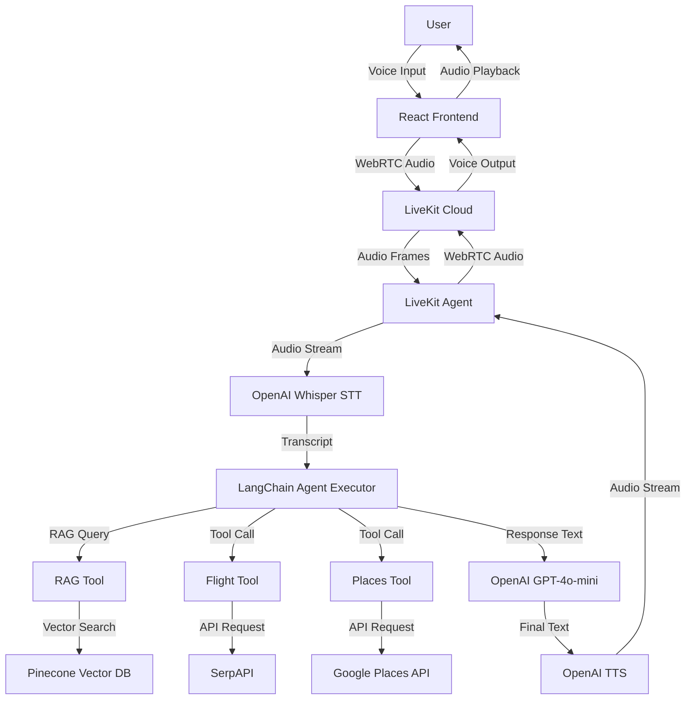

# Paradise - RAG-Enabled Travel Voice Agent

An interactive travel planning voice agent that helps users plan trips using LiveKit for real-time voice communication, LangChain RAG pipeline for PDF travel knowledge retrieval, and real-time tools for flight pricing and location suggestions.

## Quick Links

- **[Backend Setup](backend/README.md)** - Detailed backend setup, configuration, and development guide
- **[Frontend Setup](frontend/README.md)** - Frontend setup, components, and development guide
- **[Design Document](DESIGN.md)** - System architecture, RAG integration, and design decisions

## Features

- **Real-time Voice Conversation**: Speak naturally with Paradise using WebRTC
- **Live Transcription**: See your words and Paradise's responses in real-time
- **RAG-Powered Knowledge**: Answer questions from uploaded travel PDFs
- **Flight Price Lookup**: Get real-time flight prices via SerpAPI
- **Places Search**: Find cafes, restaurants, hotels, and attractions via Google Places
- **PDF Upload**: Upload your own travel guides to enhance Paradise's knowledge

## System Architecture



## Quick Start

### Prerequisites

- Python 3.10+
- Node.js 18+
- LiveKit Cloud account
- OpenAI API key
- Pinecone API key
- Optional: SerpAPI key, Google Places API key

### Setup

1. **Clone the repository**
   ```bash
   git clone https://github.com/Sudershhh/voice-agent.git
   cd voice-agent
   ```

2. **Set up backend** - See [backend/README.md](backend/README.md) for detailed instructions
   ```bash
   cd backend
   # Follow setup instructions in backend/README.md
   ```

3. **Set up frontend** - See [frontend/README.md](frontend/README.md) for detailed instructions
   ```bash
   cd frontend
   # Follow setup instructions in frontend/README.md
   ```

4. **Run the application**
   - Terminal 1: Backend agent (`python main.py dev`)
   - Terminal 2: Backend API server (`python api/server.py`)
   - Terminal 3: Frontend dev server (`npm run dev`)

## Requirements

- **LiveKit Cloud**: WebRTC infrastructure for voice communication
- **OpenAI API**: Speech-to-text (Whisper), text-to-speech, embeddings, and LLM (GPT-4o-mini)
- **Pinecone**: Vector database for RAG storage
- **SerpAPI** (optional): Flight price search
- **Google Places API** (optional): Local business search

## Project Structure

```
voice-agent/
├── backend/          # Python backend (LiveKit agent, RAG, tools)
├── frontend/         # React frontend (voice UI, transcript display)
├── README.md         # This file
└── DESIGN.md         # Detailed design document
```

For detailed project structure, see:
- [Backend structure](backend/README.md#project-structure)
- [Frontend structure](frontend/README.md#project-structure)

## Design and Architecture

For detailed information about system architecture, RAG integration, design decisions, and data flow, see the [Design Document](DESIGN.md).

